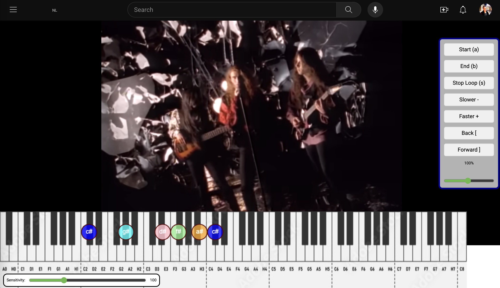

# Chrome extension: transcribe music

- Transcribe notes on a keyboard under the video 
- Make a-b loops
- Change speed

# Installation

## How to Install a Chrome Extension from a ZIP File (Developer Mode)

1. **Download the ZIP File:**
   - Download the ZIP file of the Chrome extension. Click Code at the top of this github page and then Download Zip.

2. **Extract the ZIP File:**
   - Extract the contents of the ZIP file to a folder on your computer.

3. **Open Chrome Extensions:**
   - Open Google Chrome on your computer.

4. **Access Chrome Extensions:**
   - Click on the three vertical dots in the top-right corner to open the Chrome menu.
   - Select "More tools" and then choose "Extensions."

5. **Enable Developer Mode:**
   - In the Extensions tab, enable Developer Mode by toggling the switch in the top-right corner of the page.

6. **Load Unpacked Extension:**
   - After enabling Developer Mode, you will see additional options.
   - Click on the "Load unpacked" button.

7. **Select Extension Folder:**
   - A file dialog will appear. Navigate to the folder where you extracted the extension files in Step 2.
   - Select the folder containing the extension files and click "Open."

8. **Confirm Installation:**
   - The extension should now be loaded into Chrome. You'll see its icon in the Chrome toolbar.

9. **Test the Extension:**
   - You can now use the extension as you normally would. Click on its icon in the toolbar to access its functionality.

That's it! You've successfully installed a Chrome extension from a downloaded ZIP file in developer mode.

# Examples

Good example, oscar peterson solo:
https://youtu.be/xdd5pn1xs7M?t=315

# next steps

- black key note (right half of black key makes next white key sound!)
- off when you click the extension again
- select loop in the play timeline under the video  
mousedown: starttime  
mouseup: endtime  
- visualise the loop in the play timeline under the video  
- next challenge: Guitartab with red dots!
- more testing  
- better filter against noise, improves detecting melodies