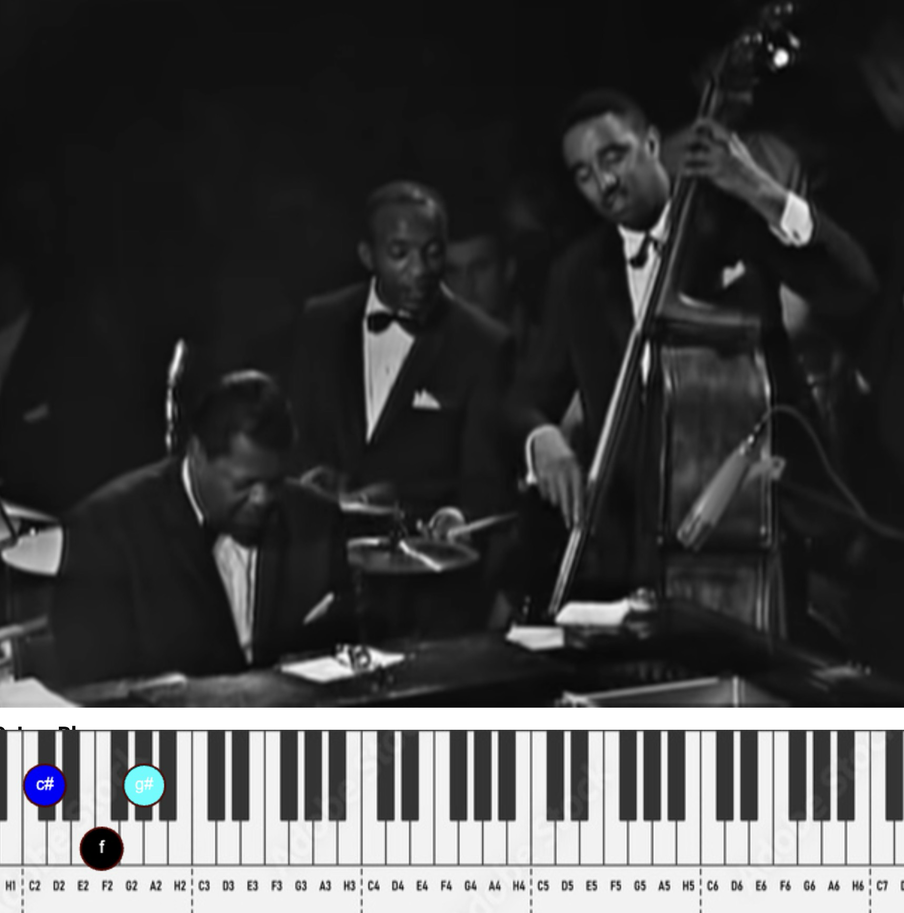

# Chrome extension: transcribe music

- Transcribe notes on a keyboard under the video 
- Make a-b loops
- Change speed

# Examples

Good example, oscar peterson solo:
https://youtu.be/xdd5pn1xs7M?t=315

# next steps

- set up chrome extension
- on/off button when you click the extension (default: on)
- add threshold input to adjust threshold for detecting notes  
- add menu with buttons and name of shortkey:  
start (a)  
end (b)  
stop loop (s)  
slower (-)  
faster (+)  
- select loop in the play timeline under the video  
mousedown: starttime  
mouseup: endtime  
- visualise the loop in the play timeline under the video  
- more testing  